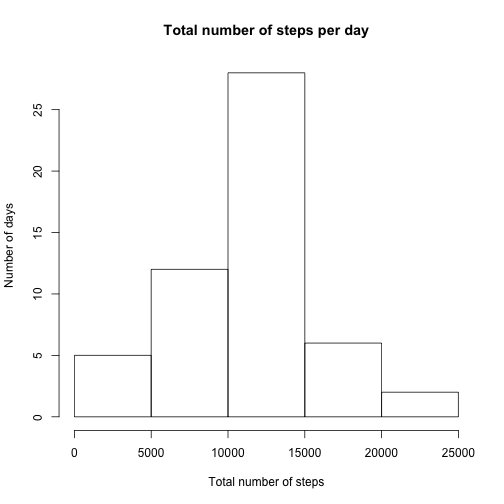
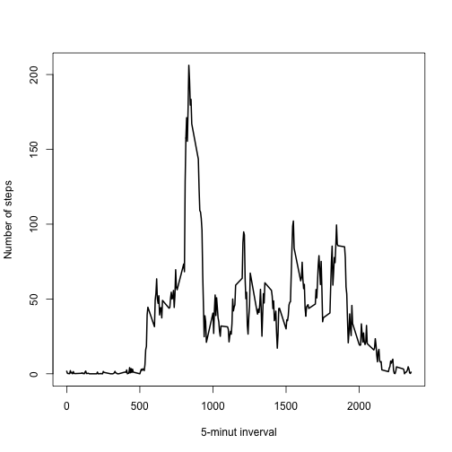
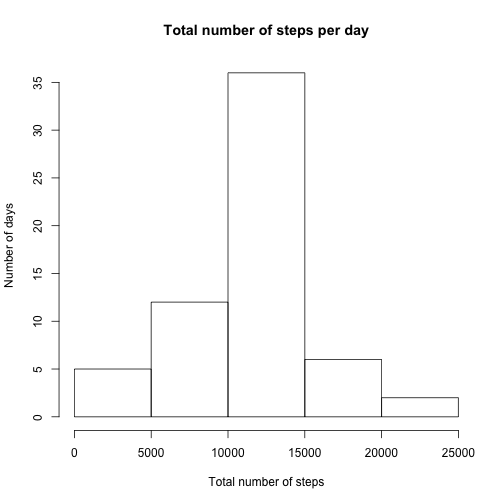
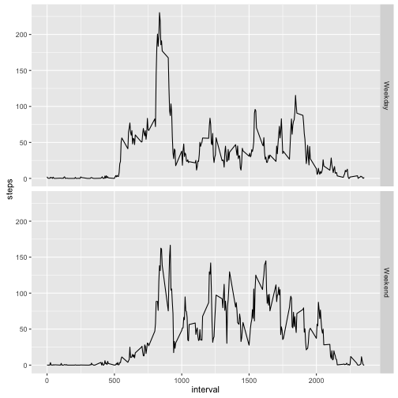

The document contains result of Course Project 1 work of Reproducible Research course

## Loading and preprocessing the data

Code listed below loads dataset and shows first 6 rows


```r
act_data <- read.csv(unz("activity.zip", "activity.csv"))

head(act_data)
```

```
##   steps       date interval
## 1    NA 2012-10-01        0
## 2    NA 2012-10-01        5
## 3    NA 2012-10-01       10
## 4    NA 2012-10-01       15
## 5    NA 2012-10-01       20
## 6    NA 2012-10-01       25
```


## What is mean total number of steps taken per day?

Code listed below does the following:

1. Calculates the total number of steps taken per day
2. Makes a histogram of the total number of steps taken each day
3. Calculates and report the mean and median of the total number of steps taken per day


```r
spd <- aggregate(steps ~ date, data=act_data, sum)

hist(spd$steps, xlab = "Total number of steps", ylab = "Number of days", main = "Total number of steps per day")
```

 

```r
mean(spd$steps)
```

```
## [1] 10766.19
```

```r
median(spd$steps)
```

```
## [1] 10765
```


## What is the average daily activity pattern?

The code listed below:

1. Makes a time series plot of the 5-minute interval (x-axis) and the average number of steps taken, averaged across all days (y-axis)
2. Identifies which 5-minute interval, on average across all the days in the dataset, contains the maximum number of steps.


```r
si <- aggregate(steps ~ interval, data=act_data, mean)

plot(si$interval, si$steps, type = "l", lwd = 2, xlab = "5-minut inverval", ylab = "Number of steps")
```

 

```r
si[si$steps == max(si$steps), 1]
```

```
## [1] 835
```


## Imputing missing values

The code listed below:

1. Calculates and report the total number of missing values in the dataset

2. Creates a new dataset that is equal to the original dataset but with __the missing data filled in with average number of steps for the same interval across all days__

3. Makes a histogram of the total number of steps taken each day and Calculate and report the mean and median total number of steps taken per day


```r
sum(is.na(act_data$steps))
```

```
## [1] 2304
```

```r
nmv <- act_data[!is.na(act_data$steps), ]

mv <- act_data[is.na(act_data$steps), ]

rmv <- merge(si, mv, by.x = "interval", by.y = "interval")[, c(2,4,1)]

names(rmv) <- names(nmv)

rmv$steps <- round(rmv$steps)

fi <- rbind(nmv, rmv)

afi <- aggregate(steps ~ date, data=fi, sum)

hist(afi$steps, xlab = "Total number of steps", ylab = "Number of days", main = "Total number of steps per day")
```

 

```r
mean(afi$steps)
```

```
## [1] 10765.64
```

```r
median(afi$steps)
```

```
## [1] 10762
```

As the result of filling in missing data there are more observations but mean and median changed insignificantly

## Are there differences in activity patterns between weekdays and weekends?

The code below:

1. Creates a new factor variable in the dataset with two levels -- "weekday" and "weekend" indicating whether a given date is a weekday or weekend day.

2. Makes a panel plot containing a time series plot of the 5-minute interval (x-axis) and the average number of steps taken, averaged across all weekday days or weekend days (y-axis).


```r
wends <- weekdays(as.Date(fi$date), abbreviate = TRUE) %in% c("Sun", "Sat")

fi$wday = "Weekday"

fi[wends, 4] = "Weekend"

fi$wday = as.factor(fi$wday)

library(ggplot2)

afi <- aggregate(steps ~ interval + wday, data=fi, mean)

qplot(interval, steps, data=afi, facets = wday ~ ., geom = "line")
```

 

